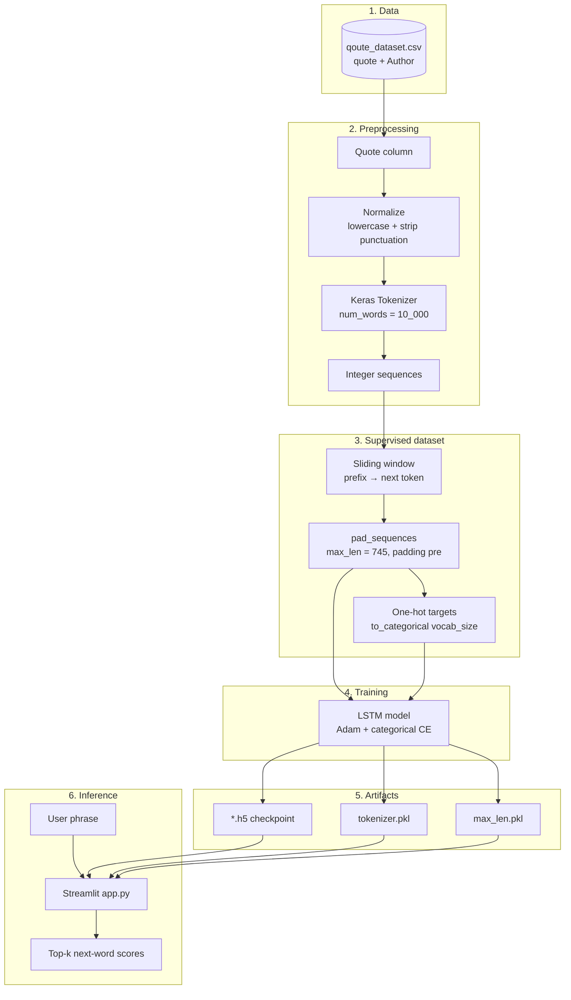
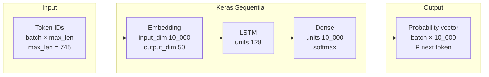

# Quote Next-Word Prediction

**Live demo (Streamlit Cloud):** [https://nextwordprediction-lz4zact2ldvdnwn5nsdips.streamlit.app/](https://nextwordprediction-lz4zact2ldvdnwn5nsdips.streamlit.app/)

## About this application

This project is a **hands-on demo of next-word prediction**: a small neural language model learns patterns from a **quotes dataset** (who said what is stored for context, but training uses the **quote text only**). Once trained—or using the **bundled model files**—you get a simple **web app** that behaves like a typing assistant for that style of language.

**What the app does for you**

- You open the Streamlit UI ([live app](https://nextwordprediction-lz4zact2ldvdnwn5nsdips.streamlit.app/) or run locally) and **type a partial phrase** (e.g. the beginning of a sentence).
- The model looks at your words as **tokens**, runs them through an **LSTM**, and outputs a **probability distribution over the vocabulary**.
- The app shows the **top next-word suggestions** (ranked, with scores)—the words the model thinks are most likely to come **immediately next**.

**What it is not**

- It predicts **one word ahead at a time**, not a full story in one shot (you could extend the notebook or app to loop predictions, but the shipped UI is focused on **single-step** suggestions).
- Results are **best when your input looks like the training data** (short quote-like English). Rare or out-of-vocabulary words cannot be encoded and may yield no prediction.

**How the pieces fit together**: optional training and export live in **`codefile.ipynb`**; the interactive experience is **`app.py`** (TensorFlow when available, otherwise **NumPy + h5py** so hosts such as Streamlit Cloud on newer Python still work). See **Overview** below for a compact map of files.

---

## Overview

| Component | Description |
|-----------|-------------|
| **Live demo** | [Next-word prediction on Streamlit Cloud](https://nextwordprediction-lz4zact2ldvdnwn5nsdips.streamlit.app/) |
| **Data** | `qoute_dataset.csv` — quote text and attributed authors |
| **Training** | `codefile.ipynb` — preprocessing, sequence dataset, Keras LSTM, persistence helpers |
| **Application** | `app.py` — loads artifacts and ranks the next token via softmax |

The model learns short-range patterns in quote-style English (lowercased, punctuation-stripped). Predictions are **in-domain**: inputs should resemble the training distribution for best results.

---

## Dataset

**File:** `qoute_dataset.csv`

| Column | Description |
|--------|-------------|
| `quote` | Full quotation text |
| `Author` | Attribution (used for analysis in the notebook; **not** fed into the tokenizer for next-word training in the provided pipeline) |

### Raw corpus statistics

Figures below refer to the CSV shipped with this repository (computed directly from `qoute_dataset.csv`).

| Statistic | Value |
|-----------|------:|
| Rows (quotes) | **3,038** |
| Columns | `quote`, `Author` |
| Unique authors | **1,005** |
| Missing `quote` values | **0** |
| Mean `quote` length (characters) | **~155** |

The corpus mixes short one-liners and long passages across many authors.

### Derived ML dataset (after preprocessing)

These figures match the pipeline in **`codefile.ipynb`**: lowercase quotes, strip punctuation, Keras `Tokenizer(num_words=10_000)`, sliding-window `(prefix → next token)` pairs, **`pre`** padding to **`max_len`**.

| Quantity | Value |
|----------|------:|
| Maximum prefix length **`max_len`** | **745** |
| Supervised examples **`(X, y)`** | **85,271** |
| Padded input shape **`X_padded`** | **(85,271 × 745)** |
| Distinct tokens in **`word_index`** (notebook) | **~8,978** |
| Model output classes **`vocab_size`** | **10,000** |

---

## Metrics

### Objective during training

Configured in Keras for the LSTM (and SimpleRNN baseline in the notebook):

| Item | Setting |
|------|---------|
| **Loss** | Categorical crossentropy |
| **Optimization** | Adam |
| **Tracked metric** | Accuracy (`metrics=['accuracy']`) |

Per-epoch history was **not** checked into the notebook snapshot in this repo; after training, inspect `model.fit()` output or log **`History`** to CSV/TensorBoard for curves.

### Reference scores on bundled checkpoint

The following numbers were obtained by **rebuilding supervised pairs from the full corpus** with the **saved** `tokenizer.pkl`, `max_len.pkl`, and **`*.h5`**, then running **`model.evaluate`** on a **random subset of 5,000** pairs (**NumPy seed 42**, batch size 256). This measures consistency of the artifacts under the training recipe; it is **not** a held-out test split (the notebook does not define a separate validation/test partition).

| Metric | Value |
|--------|------:|
| **Loss** (subset) | **~2.26** |
| **Accuracy** (subset) | **~68.9%** |
| **Evaluate sample size** | **5,000** |

For a strict generalization estimate, split quotes or sequences **before** building sliding-window pairs, then report **`val_loss` / `val_accuracy`** from `model.fit(validation_data=...)`.

*`fit()` hyperparameters (epochs, batch size, callbacks) are defined in **`codefile.ipynb`**.*

---

## Methodology (training notebook)

The workflow in **`codefile.ipynb`** follows standard character/word-level language-modeling steps adapted for **word tokens**:

1. **Load** quotes from `qoute_dataset.csv` (`df['quote']`).
2. **Normalize** text: lowercase; remove punctuation via `str.translate` and `string.punctuation`.
3. **Tokenize** with Keras `Tokenizer` capped at **`num_words = 10_000`** (`vocab_size`). The fitted vocabulary is smaller than the cap when unique tokens are fewer than 10k (e.g. **~8.9k** words in the notebook output).
4. **Build supervised pairs** with a sliding window over each token sequence: for every prefix `seq[:i]`, predict the next token `seq[i]`. This yields on the order of **~85k** `(input, target)` samples for the saved configuration.
5. **Pad** all input prefixes to **`max_len`** (maximum prefix length over the training set — **745** in the notebook run) using **`padding='pre'`**.
6. **Encode targets** with one-hot vectors of size **`vocab_size`** (`to_categorical`) for **`categorical_crossentropy`**.
7. **Train** a sequential model (notebook includes both **SimpleRNN** and **LSTM** variants); the deployed app expects the **LSTM** checkpoint saved as HDF5.

Artifacts written by the notebook (aligned with the UI):

- `tokenizer.pkl` — fitted tokenizer  
- `max_len.pkl` — integer padding length  
- `lstm_model.h5` — trained model (local filenames such as `lstm_model (1).h5` also work if you keep a single `*.h5` in the app folder)

### Diagrams

The figures below use **[Mermaid](https://mermaid.js.org/)** syntax; they render automatically on **GitHub** and in many Markdown previews.

#### Figure 1 — End-to-end pipeline (data → training → app)



#### Figure 2 — LSTM architecture (tensor shapes)



---

## Model architecture (LSTM)

Configured in the notebook (see **Figure 2** above for a compact block diagram):

| Layer | Configuration |
|-------|----------------|
| **Embedding** | `input_dim = 10_000`, `output_dim = 50`, `input_length = max_len` |
| **LSTM** | `units = 128` |
| **Dense** | `units = 10_000`, `activation = softmax` |

**Optimization:** Adam · **Loss:** categorical crossentropy · **Metric:** accuracy (see **Metrics** section for reference evaluation numbers).

---

## Streamlit application

**Entry point:** `app.py`

The UI:

- Discovers **one** HDF5 model file in the project directory (`*.h5`; first lexicographic name wins if several exist).
- Loads **`tokenizer.pkl`** and **`max_len.pkl`** once (cached).
- Accepts user text, tokenizes with the **same** tokenizer, pads with **`pre`** padding to **`max_len`**, and displays **top‑k** next-word candidates with scores.

### Running locally

```powershell
cd path\to\next_word_prediction
python -m venv .venv
.\.venv\Scripts\Activate.ps1
pip install -r requirements.txt
# optional: TensorFlow backend (needs Python ≤3.12 wheels from TensorFlow)
pip install -r requirements-local.txt
streamlit run app.py
```

Open **http://localhost:8501** in your browser.

**Requirements:** **`requirements.txt`** is enough to run the app (NumPy + h5py + Streamlit). For the TensorFlow code path, also install **`requirements-local.txt`** (TensorFlow currently skips Python 3.14).

Whenever you change **`tokenizer.pkl`**, regenerate **`tokenizer_word_index.json`** for TensorFlow-free deploys:

```bash
python export_tokenizer_json.py
```

---

## Deploying on Streamlit Community Cloud (`*.streamlit.app`)

**This project’s hosted instance:** [https://nextwordprediction-lz4zact2ldvdnwn5nsdips.streamlit.app/](https://nextwordprediction-lz4zact2ldvdnwn5nsdips.streamlit.app/)

This repo’s **`requirements.txt`** installs only **Streamlit, NumPy, and h5py** — no TensorFlow — so dependency resolution succeeds even when Community Cloud uses **Python 3.14**.

Inference uses **`numpy_inference.py`** plus **`tokenizer_word_index.json`** (run **`python export_tokenizer_json.py`** after changing `tokenizer.pkl`) and the same **`*.h5`** / **`max_len.pkl`** as before.

If TensorFlow **is** available locally or on another host, `app.py` will prefer it automatically.

Optional: you can still deploy with **Python 3.11 / 3.12** and use **`requirements-local.txt`** if you want the TensorFlow backend in the cloud.

---

## Deploy with Docker (optional)

The **`Dockerfile`** uses **Python 3.11** and installs **`requirements.txt`** only (lightweight: Streamlit + NumPy + h5py). Add a `pip install -r requirements-local.txt` layer yourself if you want TensorFlow inside the container.

From the project root:

```bash
docker build -t nextword-predict .
docker run -p 8501:8501 nextword-predict
```

Open **http://localhost:8501**.

Typical hosts: **Railway**, **Render**, **Fly.io**, **Google Cloud Run**, **Azure Container Apps**.

---

## Repository layout

```
next_word_prediction/
├── app.py                          # Streamlit UI (TensorFlow if installed, else NumPy)
├── numpy_inference.py              # TF-free inference (h5py reads Keras H5 weights)
├── export_tokenizer_json.py       # Refresh tokenizer_word_index.json after retraining
├── tokenizer_word_index.json      # Needed when TensorFlow is not installed (Streamlit Cloud 3.14)
├── Dockerfile                      # Optional: locked Python 3.11 for Docker hosts
├── .dockerignore
├── requirements.txt                # streamlit, numpy, h5py (works on Python 3.14)
├── requirements-local.txt          # Adds tensorflow-cpu for local TF backend
├── runtime.txt                     # Hint for some hosts
├── STREAMLIT_CLOUD_PYTHON_FIX.txt  # Older TensorFlow-on-Cloud troubleshooting
├── codefile.ipynb                  # Data prep + model training + pickle export
├── qoute_dataset.csv               # Quotes corpus (CSV)
├── tokenizer.pkl                   # From notebook (local TF path); JSON mirrors vocabulary for cloud
├── max_len.pkl                     # Produced by notebook (required for app)
└── *.h5                            # Trained Keras LSTM (required for app)
```

---

## Limitations

- **Out-of-vocabulary (OOV)** words are dropped by the tokenizer at inference time; if nothing maps to an ID, the app cannot propose a next word.
- Predictions reflect **quote-like** training data only; general prose or technical jargon may rank poorly.
- Author labels are not used by the next-word model in the documented notebook path—only the quote column feeds the tokenizer.
- **TensorFlow-free inference** reads weights from fixed HDF5 paths inside **`numpy_inference.py`**. If you retrain and Keras saves different layer/group names, update that loader or use the TensorFlow path locally.

---

## Extending the project

- Retrain with more data or a larger `vocab_size`, then re-export **`tokenizer.pkl`**, **`max_len.pkl`**, and **`lstm_model.h5`** together so shapes stay consistent.
- Prefer saving models in the native **`.keras`** format for newer TensorFlow releases; the current UI loads **HDF5** via `load_model`.

---

## Acknowledgments

Quotations and attributions are aggregated in **`qoute_dataset.csv`** for educational use in this demonstration pipeline.
